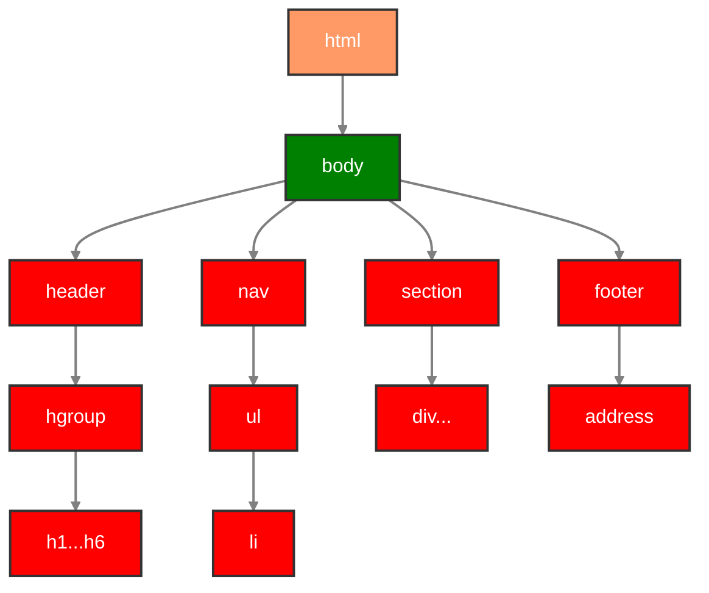

# CASCADING Style Sheet 


--- 

## Cascading의 의미와 CSS의 원리


위의 그림은 계단모양을 하고 있다. 이 동영상에서는 이 그림이 의미하는 바를 설명한다.



<!-- 
linkStyle 0 stroke-width:2px,fill:none,stroke:blue,color:white;
    linkStyle 1 stroke-width:2px,fill:none,stroke:green;
    linkStyle 2 stroke-width:2px,fill:none,stroke:yellow;
    linkStyle 3 stroke-width:2px,fill:none,stroke:pink;
    linkStyle 4 stroke-width:2px,fill:none,stroke:pink;
 -->

## CASCADING
캐스케이딩은 CSS를 적용시키고자 하는 특정 엘리먼트에 지정한 property에 대해 선언 된 값'들'의 정렬되지 않은 목록을 취합하여 property선언의 우선 순위에 따라 정렬 한 다음 하나의 cascading value(winning value)를 출력합니다.

### 출처와 중요도(Origin and Importance)
Important User Agent declaration : IE의 사례
Tools > Internet Options > Accessibility


### 明細度(얼마나 명확하고 세부적인지)

몇대 자손인지는 명세도에 영향이 없다. 즉, 자식이건 증손자건 10대손이건 그저 '자손'일 뿐이다.


```css
body h1 {
  color: green;
}
html h1 {
  color: purple;
}
```

다음 HTML로:
```html
<html>
<body>
  <h1>Here is a title!</h1>
</body>
</html>
```
요소와 주어진 선택자로 참조된 다른 요소와의 근접도(proximity)는 명시도에 영향을 주지 않습니다. 다음 스타일 선언은:

body h1 {
  color: green;
}
html h1 {
  color: purple;
}
다음 HTML로:

<html>
<body>
  <h1>Here is a title!</h1>
</body>
</html>
### 나타나는 순서(Order of Appearance)
1. Inline
2. Embeded
3. External