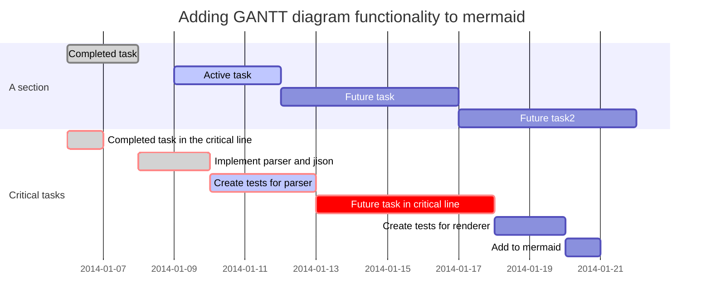
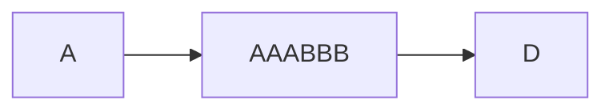
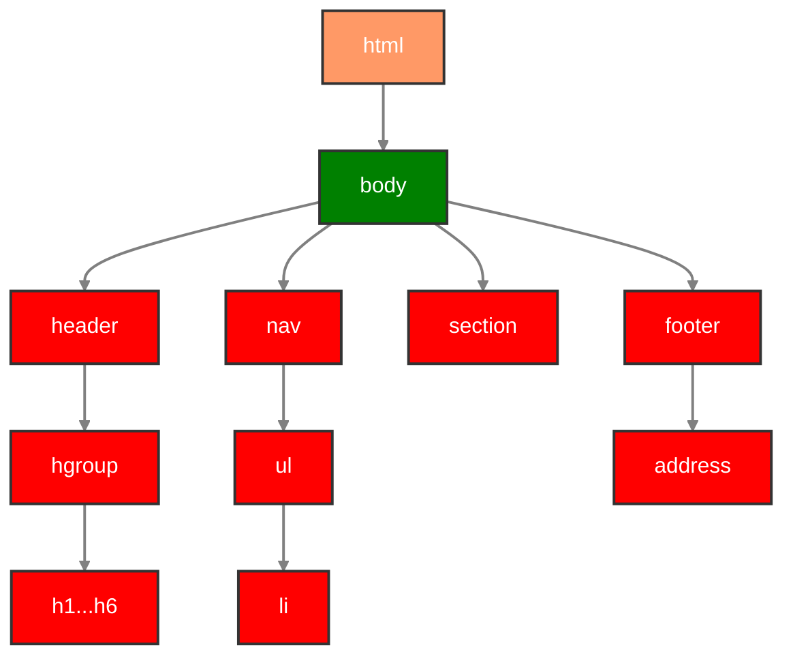
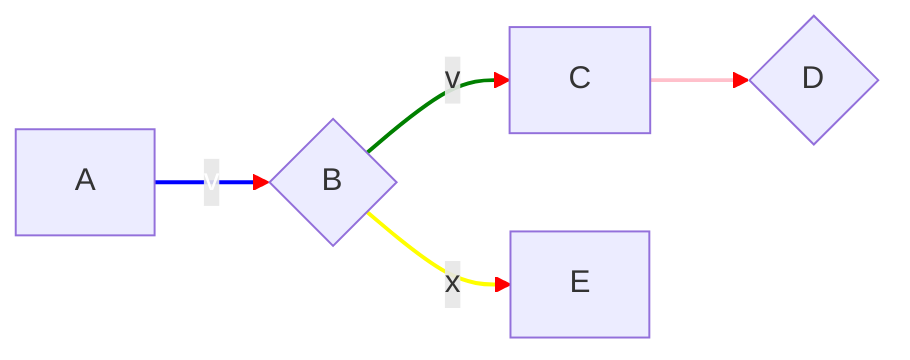
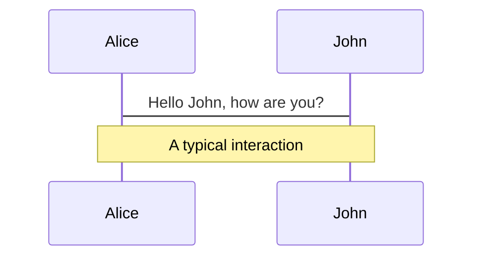
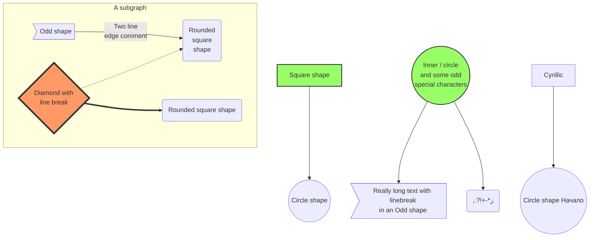

<!-- 
linkStyle 0 stroke-width:2px,fill:none,stroke:blue,color:white;
    linkStyle 1 stroke-width:2px,fill:none,stroke:green;
    linkStyle 2 stroke-width:2px,fill:none,stroke:yellow;
    linkStyle 3 stroke-width:2px,fill:none,stroke:pink;
    linkStyle 4 stroke-width:2px,fill:none,stroke:pink;
 -->







```mermaid
graph TD;

subgraph Line breaks <br /> don't work in <br /> Subgraphs
    inset[Line breaks <br />\nwork in <br />Insets]
end

    inset-->A

  A(Line breaks<br />work in<br />rounded rec nodes)
  B{Line breaks <br />work in<br />decision nodes}
  C[Line breaks<br />work in<br /> rectangles]
  D((Line breaks <br />work in <br />circles))
  E>Line breaks <br />work in <br />flag nodes]

    A-->B
    B--yes-->C
    B--no-->E
    C-->D
 

style A fill:#ed6,stroke:#333,stroke-width:2px;
style B fill:#ed6,stroke:#333,stroke-width:2px;
style C fill:#ed6,stroke:#333,stroke-width:2px;
style D fill:#ed6,stroke:#333,stroke-width:2px;
style E fill:#ed6,stroke:#333,stroke-width:2px;
style inset fill:#ed6,stroke:#333,stroke-width:2px;
```

