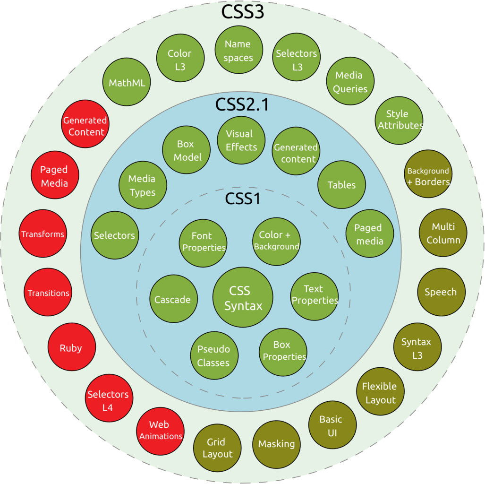

# CSS Module이란 무엇인가.
---

## 강의의 목적

본격적으로 CSS에 들어가기 위해 W3C의 CSS spec에 대한 기본적인 이해를 도울 목적으로 몇 가지 개념과, 스스로 W3C spec을 찾고 싶을 경우 W3C의 수 많은 CSS 관련 문서 중 어떤 CSS 문서에 어떤 식으로 접근할지에 대해서 알아본다.

## 목차

### - CSS Modules은 무엇인가.
### - CSS Module의 사례
### - CSS snapshot
### - W3C 권고안(recommendation)이 나오기 까지의 진행과정
### - 각 Module 뒤에 붙는 숫자의 의미

## CSS3부터는 같은 범주의 property들 끼리 모듈화(Modulize)했다.

CSS3에 들어서면서 부터 'Modules'라는 용어가 등장한다. 각 module은 CSS2.1을 기반으로 세분화되며 CSS 2.1을 이어받은 상태에서 내용이 더 많아지고 부족한 부분이 보완되었다. 아래의 링크로 가면 'Why modules'라는 구절이 있는데 

### Why Modules 
관련링크 : https://www.w3.org/TR/2001/WD-css3-roadmap-20010523/#whymods

As the popularity of CSS grows, so does interest in making additions to the specification. Rather than attempting to shove dozens of updates into a single monolithic specification, it will be much easier and more efficient to be able to update individual pieces of the specification. Modules will enable CSS to be updated in a more timely and precise fashion, thus allowing for a more flexible and timely evolution of the specification as a whole.

For resource constrained devices, it may be impractical to support all of CSS. For example, an aural browser may be concerned only with aural styles, whereas a visual browser may care nothing for aural styles. In such cases, a user agent may implement a subset of CSS. Subsets of CSS are limited to combining selected CSS modules, and once a module has been chosen, all of its features must be supported.

위의 내용은 대략

CSS가 인기를 끌고 유행함에 따라 사용자들이 spec의 추가 또는 업데이트에 관심을 가진다. 만약 스펙 전체를 통째로 업데이트하게 될 경우 이미 구현이 가능한 spec들(주로 property들)의 업데이트가 아직 완결되지 않은 spec들 때문에 늦춰지므로 적시에 적확한 사양을 각 모듈의 <q>개별 업데이트</q> 자체로 종결지어 적용시키므로써 유행에 신속하고 유연하게 대처하려고 함이다. 즉, 한마디로

> CSS3 부터 property, selector등 전체를 하나의 spec으로 다루기엔 양이 너무 많아졌으므로...   

### CSS Module의 사례

당연한 말이지만 CSS Modules의 범주 속에는 같은 종류의 property들이 속한다. 예를 들어 Font Module을 보자.

- font-style
- font-variant
- font-weight
- font-stretch
- font-size
- line-height
- font-family
- font
- ...

처럼 'font'와 관련된 property들을 같은 범주 속에 묶어 놓았다.

     

## CSS snapshot
앞서 말한 것 처럼 CSS property들의 발표시기가 제 각각이기 때문에 CSS Level 3에 포함되는 property가 뭐냐고 물어보면 명확한 답을 할 수 없게 되었다. 나날이 달라질 수 있으므로... 그래서 W3C에서는 Snapshot이라는 형식의 문서를 만들었는데, 'snapshot'이란 어떤 순간의 상태를 말하는 것으로써 예를 들어 'CSS Snapshot 2018'이라면 2018년도 특정일을 기준으로 '발표'된 property들의 상태를 뜻한다.

<!-- 

## 그렇다면 시각적 스타일 작성자는 청각스타일을 무시해도 될까? 그렇지 않을 수 있는 방법은 무엇인가.

위와 같은 이유에 의해, 시각스타일을 위주의 문서를 작성할 경우 청각장애인에 대한 배려는 아예 무시해도 좋은지를 생각해야만 한다. 왜냐하면 크롬 파이어폭스등의 브라우저에서 화면을 읽어주는 screen reader 지원이 아직 많이 미비하기 때문에 청각장애인은 스크린을 읽어주는 전문 app으로 문서에 접급하려면 시각 위주의 스타일 문서를 작성하는 사람이 최소한 배려해야 될 것이 있는데 그 것은 CSS가 아닌 HTML을 semantic document로 작성하는 것이다.

즉, HTML에 정의된대로 문서를 작성하는 것이다. Semantic document에 대해서는 HTML section에서 구체적으로 논의하기로 한다. 
 -->

아래의 링크는 CSS3에 대한 정보를 주는 사이트로써 

- CSS3 Info - http://www.css3.info/modules/

각 모듈별 업데이트 현황을 알 수 있다.

## W3C 권고안(recommendation)이 나오기 까지의 진행과정

### 1. Announced
발표되었을 뿐 아직 작동되는 초안이나 다른 정보는 없다. 시작선언을 명시하는 정도다.

### 2. Working Draft (WD)
WD는 W3C 회원, 대중 및 기타 기술 조직을 포함하여 W3C가 커뮤니티들의 검토를 위해 게시하는 문서. 전부는 아니지만 일부 작업 초안은 권고안으로 진행하기위한 것이다.

### 3. Last Call (LC)
일반적으로 Last Call 발표는 실무 그룹이 추후에 기술 보고서(Technical Report)의 완성도를 높일 계획임을 알리는 신호이다. LC 발표는 검토의견에 대한 구체적 기한을 명시하고, 실무 그룹이 실무 초안의 관련 기술 요구사항 (예를 들어 문서 요구사항 등)을 충족했다고 믿고 있음을 나타낸다.

### 4. Candidate Recommendation (CR)
후보 권고안은 W3C 관계그룹들을 통해 광범위하게 검토되었으며 실무 그룹의 기술요구사항을 충족한다고 믿는 문서이다. W3C는 후보자 추천서를 발표하여 경험적 구현을 수집한다.

### 5. Proposed Recommendation (PR)
제안 권고안은 기술적 완성도 및 구현 가능성에 대한 광범위한 검토 후 W3C가 최종 승인을 위해 W3C 자문위원회에 보낸  기술 보고서이다.

### 6. W3C RECommendation (REC)
W3C 권고안은 광범위한 합의를 구축 한 후 W3C 회원 및 감독의 승인을받은 사양 또는 지침 세트이다. W3C는 권장 사항의 광범위한 배포를 권장한다. 

## Taxonomy and status of CSS3 modules

[출저: https://en.m.wikipedia.org/wiki/Cascading_Style_Sheets#/media/File%3ACSS3_taxonomy_and_status-v2.png ]  

## 각 Module 뒤에 붙는 숫자의 의미

CSS spec의 각 모듈 뒤에는 숫자가 붙는다. 예를 들어 

- CSS Animation 1

이라면 CSS Level 3 부터 새로 생긴 properties 이고

- CSS Font 3 (Current Work)

이라면 CSS Level 1 부터 생겨서 CSS 2를 거쳐 현재 CSS 3까지 계속 업데이트되고 새로운 property도 추가되었다는 의미다. 'Current Work'은 현재 구현되고 있다는 의미다. 물론 IE(Internet Explorer)나 minor browser등에서는 구현되지 않을 수 있다.

- CSS Font 4 

라고 되어있고 괄호 속에 'Current Work'가 없다면 현재 개발중인 스펙이므로 구현되지 않거나 부분구현(partial implementation)되는 spec이다. 따라서 spec은 각 브라우저별 호환성을 고려하여, 사용을 보류하는 것이 좋을 것이다.

---