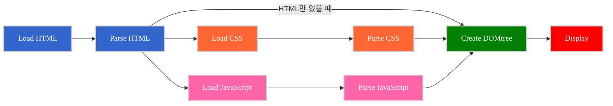

## Dom Tree가 생성되는 순서를 간략화시킨 그래프

```mermaid
graph LR
        HTML[Load HTML]-->Parse[Parse HTML];
        Parse--HTML만 있을 때-->domTree[Create DOMtree];
        Parse-->CSS[Load CSS];
        CSS-->PCSS[Parse CSS];
        PCSS-->domTree;
        domTree-->Display;
        Parse-->JS[Load JavaScript];
        JS-->PJS[Parse JavaScript];
        PJS-->domTree;

     classDef blue fill:#36c,stroke:#ccc,stroke-width:2px,color:white,font-family:verdana;
     classDef orange fill:#f63,stroke:#ccc,stroke-width:2px,color:white,font-family:verdana;
     classDef green fill:green,stroke:#ccc,stroke-width:2px,color:white,font-family:verdana;
     classDef red fill:#f00,stroke:#ccc,stroke-width:2px,color:white,font-family:verdana;
     classDef common fill:#f6a,stroke:#ccc,stroke-width:2px,color:white,font-family:verdana;

     class HTML,Parse blue;
     class CSS,PCSS orange;
     class domTree green;
     class Display red;
     class JS,PJS common; 

```
