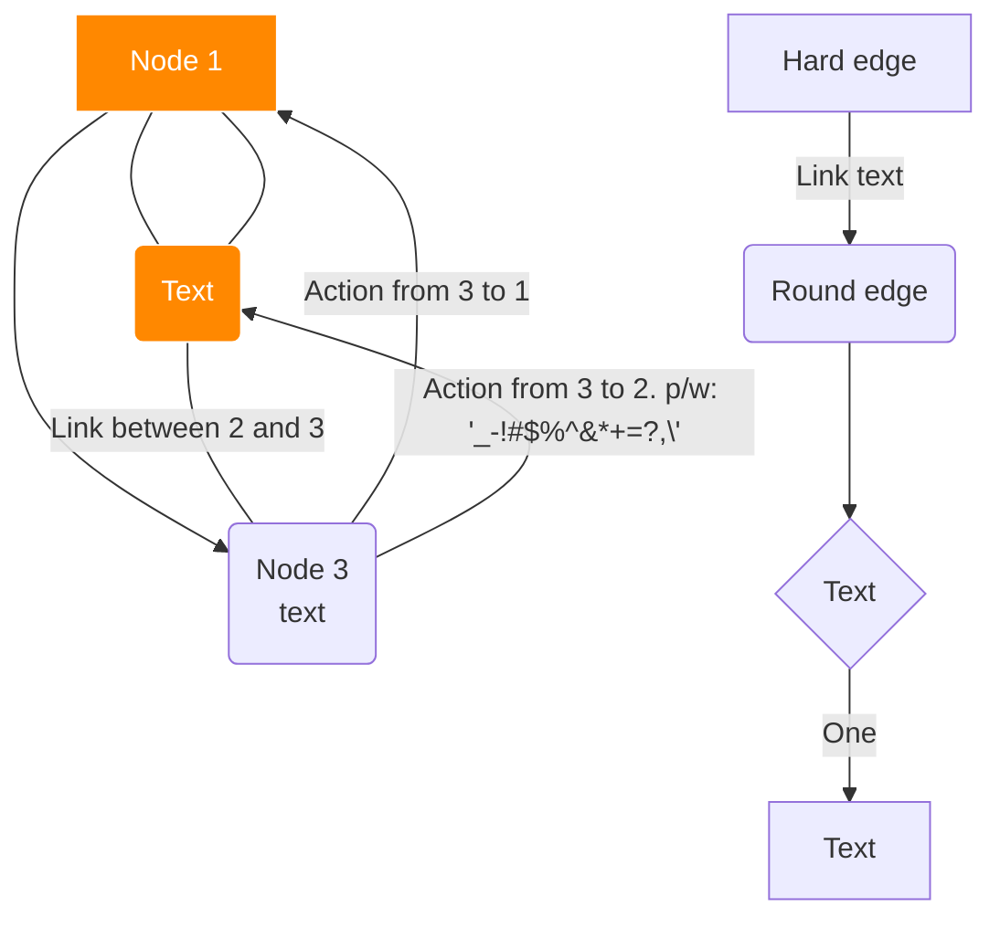

# 유뷰브에 동영상 올린 후 해야하는 일들. 

--- 

## 등록내용 만들기

내용들

> 제목 :
> Video URL : 
> Description :
> Tag :

## 카드 작성

## 최종화면 작성

```mermaid
graph TB 
  ID-1[Node 1]
  ID-2[Node 2]
  ID-3(Node 3 <br> text)
  ID-1---ID-2
  ID-1 --> ID-3
  ID-2--Link between 2 and 3---ID-3
  ID-3-->|Action from 3 to 1|ID-1
  ID-3 -- "Action from 3 to 2. p/w: '_-!#$%^&*+=?,\'" --> ID-2
  A[Hard edge] -->|Link text| B(Round edge)
  ID-1---ID-2(Text)
  B --> C{Text}
  C -->|One| D[Text]
  classDef blue fill:#08f,stroke:#fff,color:#fff;
  classDef red fill:#f80,stroke:#fff,color:#fff;
  class ID-1 blue
  class ID-1,ID-2 red
  click ID-1 "https://github.com" "Tooltip text"
  click ID-2 alert "Tooltip for a callback"
 
```